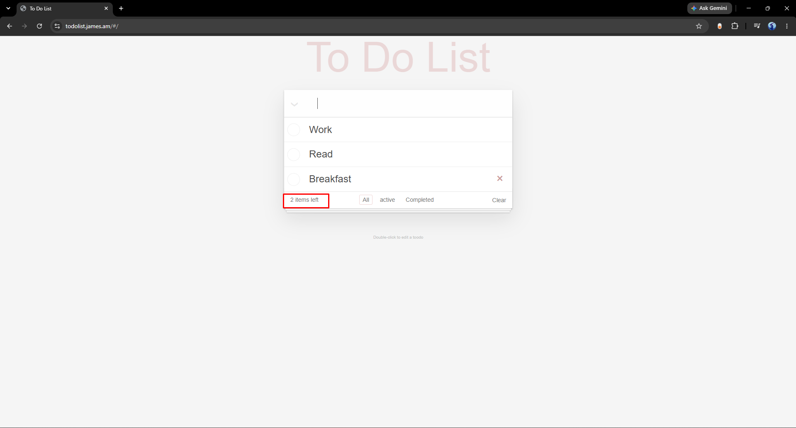
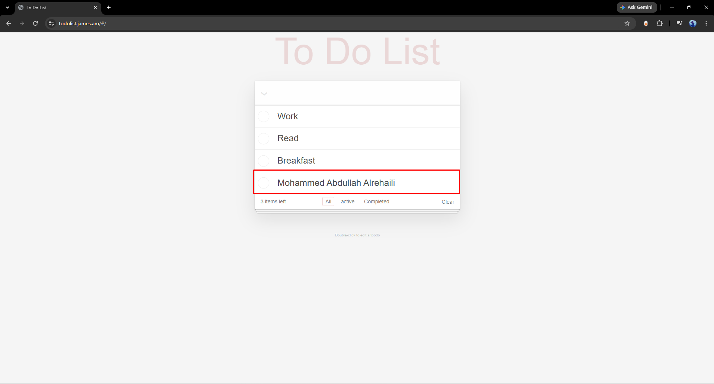
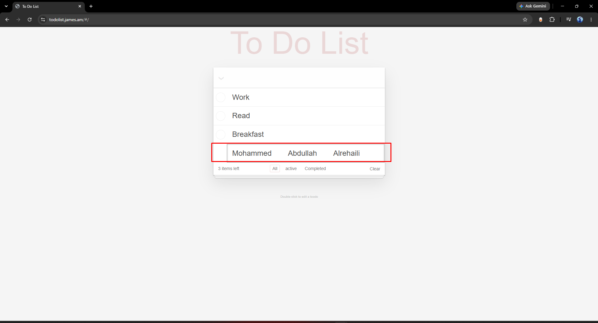
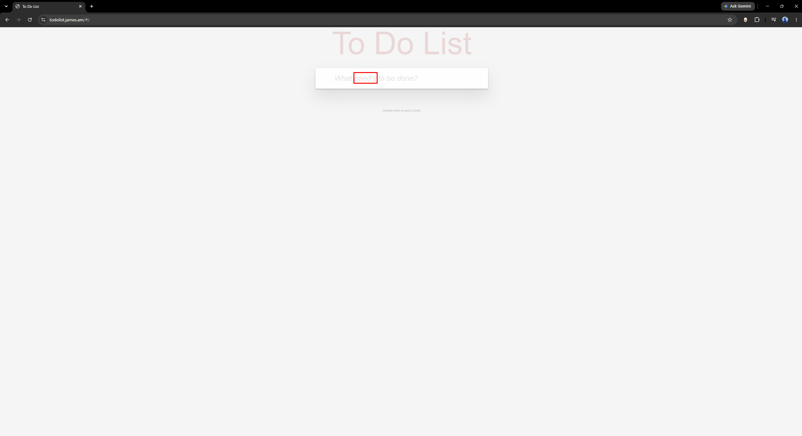
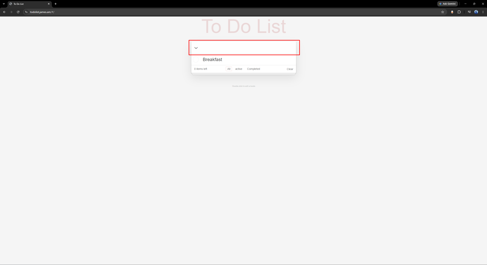

# To Do List — Bug Reports

Source: Defect Reports board

---

## Bug 1 — Items counter -> "Items left" counter shows one fewer than the actual number of active tasks

**Priority:** High

**Steps to reproduce:**
1. Add three tasks.
2. Leave all three tasks unchecked.
3. Observe the items counter.

**Expected Result:**
Since all 3 tasks are active and none are completed, the counter should display "3 items left".

**Actual Result:**
The counter displays "2 items left" — one less than the actual count of active tasks, indicating the counter logic is off by one.

**Screenshot of the bug:**

---

## Bug 2 — Display text -> Task display collapses multiple whitespace characters into a single space, while edit mode preserves them

**Priority:** Low

**Steps to reproduce:**
1. Add a new task with multiple consecutive spaces between words.
2. Press Enter to submit and view the task in the list.
3. Double-click the task to enter edit mode and observe the text in the input field.

**Expected Result:**
The task title should display consistently in both view mode and edit mode — if multiple whitespace characters were typed and saved as part of the task text, they should be preserved and shown the same way in both states.

**Actual Result:**
In view mode, the multiple consecutive spaces are collapsed and rendered as a single space between words. In edit mode, the full original whitespace (all the spaces as typed) reappears in the input field. The same underlying data renders inconsistently depending on the view.

**Screenshot of the bug:**

View mode (spaces collapsed):

Edit mode (spaces preserved):

---

## Bug 3 — Placeholder text -> Input placeholder contains a grammatical error ("need's" instead of "needs")

**Priority:** Low

**Steps to reproduce:**
1. Observe the placeholder text displayed inside the empty input field before any task is typed.

**Expected Result:**
The placeholder should read "What needs to be done?" — using the correct verb form "needs" (no apostrophe), since it is not a contraction or a possessive.

**Actual Result:**
The placeholder text incorrectly displays "What need's to be done?", with an unnecessary apostrophe inserted before the "s".

**Screenshot of the bug:**

---

## Bug 4 — Toggle-all -> Toggle-all icon requires two clicks to revert all tasks to active when all are completed

**Priority:** Not set

**Steps to reproduce:**
1. Add multiple tasks.
2. Mark all tasks as completed, either individually or via the toggle-all icon.
3. Click the toggle-all icon once to revert them to active.
4. Observe the task states after the single click.

**Expected Result:**
A single click on the toggle-all icon (when all tasks are completed) should immediately revert all tasks back to active status.

**Actual Result:**
One click on the toggle-all icon has no effect (or only partially registers); a second click is required before all tasks actually revert to active. This suggests the toggle-all state/logic is out of sync with the actual completion state of the tasks, likely requiring two state transitions to correct itself.

**Screenshot of the bug:**

---

## Bug 5 — Input field -> Input field does not fully clear after submitting input

**Priority:** Low

**Steps to reproduce:**
1. Type a task name.
2. Press Enter to submit the task.

**Expected Result:**
The input field should be completely reset to an empty string and display the placeholder text "What need's to be done?", ready for immediate entry of the next task.

**Actual Result:**
The input field appears blank but does not show the placeholder text, indicating a residual whitespace character remains in the field instead of it being fully cleared.

**Screenshot of the bug:**

